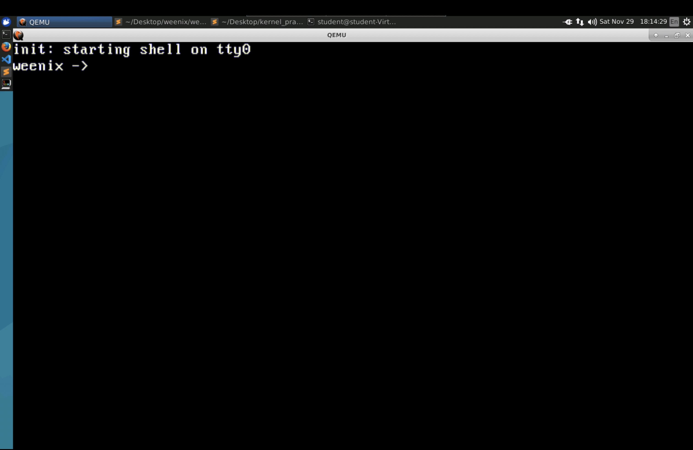
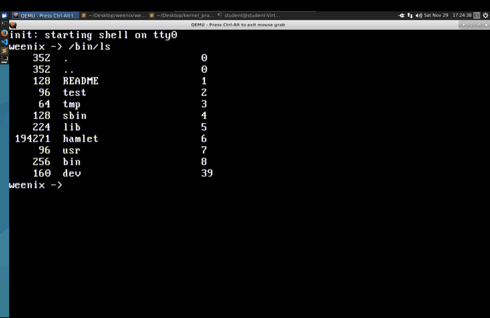
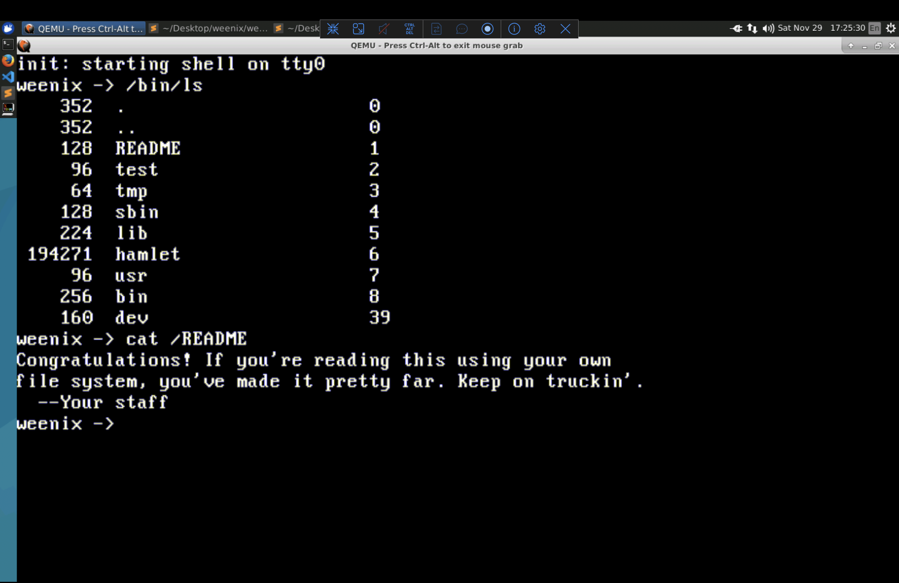
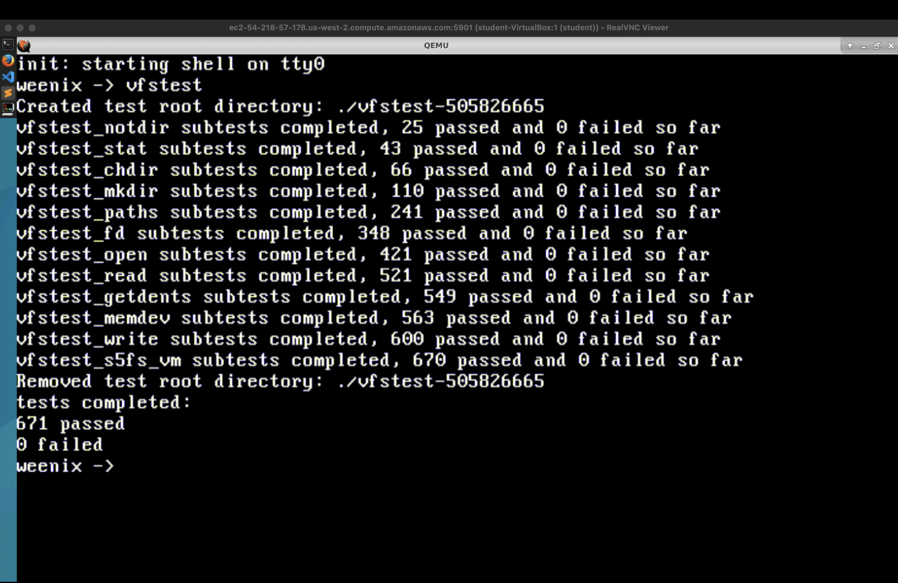
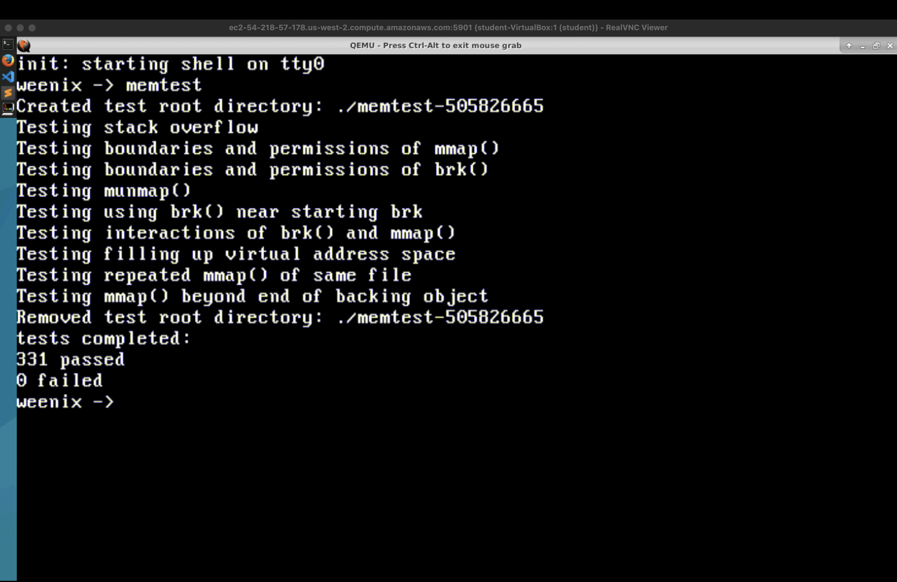
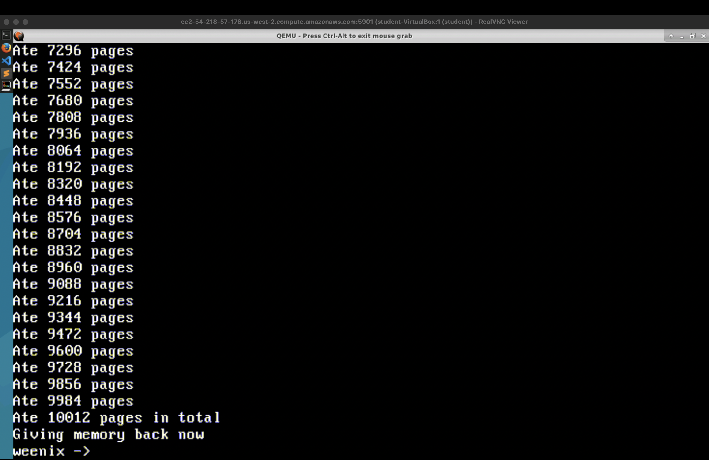
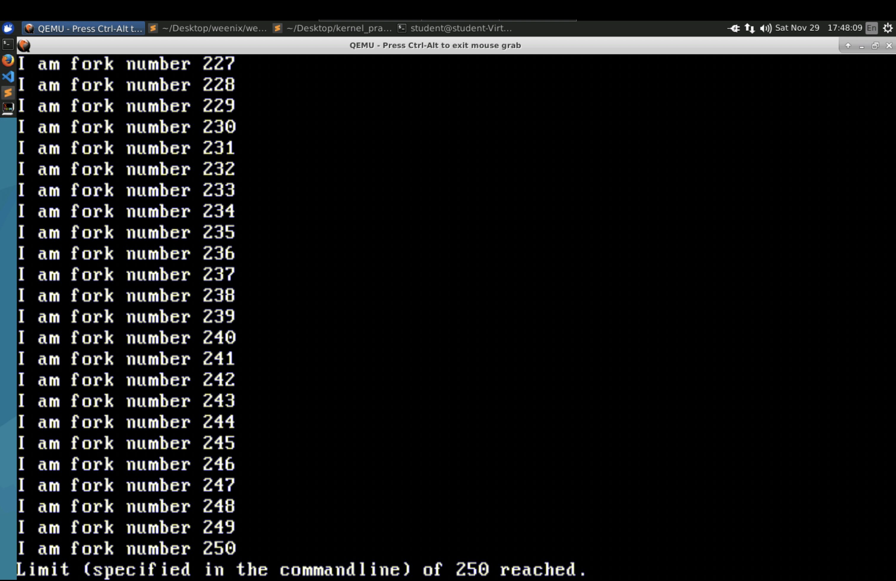
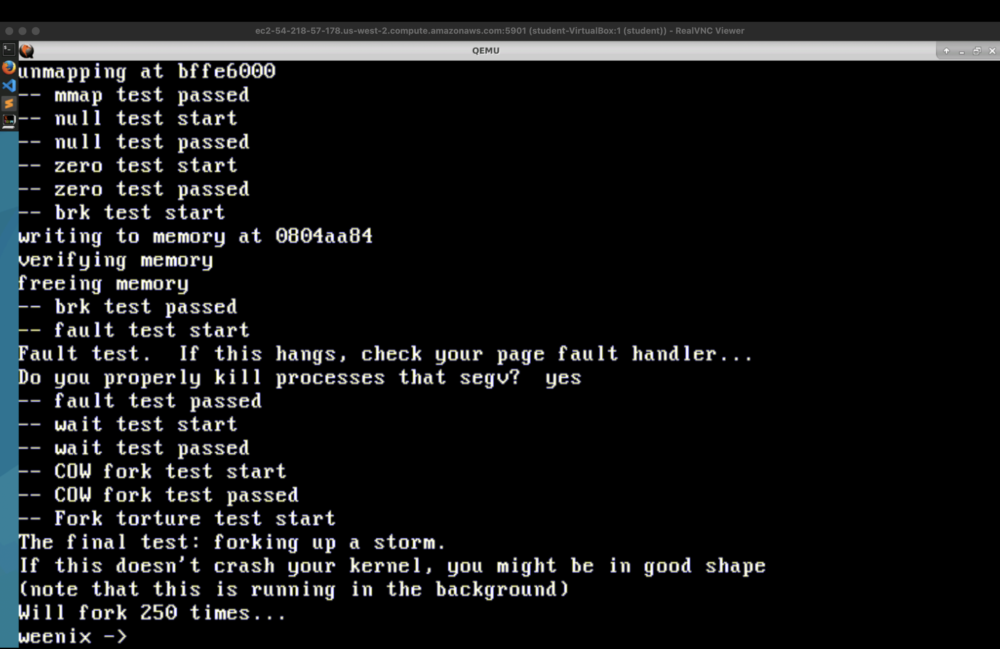
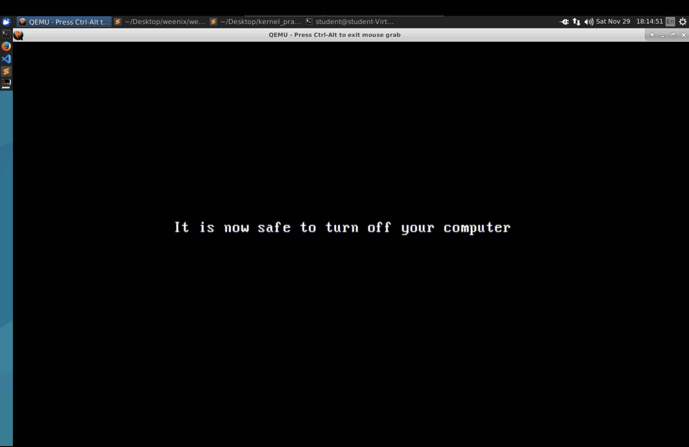

# Weenix OS

This repository documents my work on building major subsystems of **Weenix OS** for the [CS402 Operating Systems](https://ec2-52-25-47-20.us-west-2.compute.amazonaws.com/cs402-f25/) course at USC.  
Weenix is an educational operating system originally developed at Brown University. My work involved implementing core kernel components from scratch, bringing process management, file systems, and a full virtual memory subsystem to life.

Although the project is closed-source, this README provides a detailed look at the architecture and engineering work behind my implementation.

---

## Overview of What I Implemented

### 1. Process Management (PROCS)

I implemented the kernel’s process and thread subsystem on a **single-core machine** running a **cooperative scheduler**.  
Because the system has only one kernel thread, there is no preemption: context switches happen only when the currently running thread voluntarily yields or finishes.

My implementation includes:

- Process lifecycle management
- Thread creation, destruction, and cleanup
- Context switching using saved CPU registers
- A FIFO run queue for scheduling
- Correct handoff between kernel and user modes
- Safe transitions through system calls

---

### 2. Virtual File System (VFS)

I built the Weenix VFS layer as a **polymorphic abstraction** that allows the kernel to interact with different underlying file system implementations.  
My implementation supports:

- **RAMFS** – a fully in-memory file system
- **S5FS** – a disk-based file system modeled after UNIX V6

Key components I implemented:

- `vnode` abstraction and vnode operations
- Pathname resolution (`lookup()`, `dir_namev()`)
- System calls for file operations (open, read, write, mkdir, link, stat, etc.)
- Precise reference counting and cleanup logic

This design ensures that upper layers interact only with abstract vnodes, while concrete file systems handle the underlying logic.

---

### 3. Virtual Memory (VM)

I implemented the VM subsystem that enables user programs to execute, allocate memory, and spawn child processes.  
This included both address-space management and demand paging.

#### **Multi-level Page Directory Structure**

Weenix uses a two-level paging design, consisting of:

- Page Directory
- Page Tables

My work involved:

- Per-process page directory creation
- Virtual-to-physical frame mapping
- Permission and flag management
- Sparse virtual address space handling
- Kernel–user space isolation

---

#### **Page Fault Handler**

I implemented the core page fault logic, which must:

- Decode fault type
- Consult the VM map
- Instantiate page table entries
- Allocate frames lazily
- Handle anonymous and file-backed regions

Correct fault handling was essential for running the user shell and passing stress tests.

---

#### **Copy-On-Write with Shadow Mmobjs**

To support efficient `fork()`, I implemented:

- **Shadow mmobjs** layered between parent and child
- Refcounted anonymous mmobjs
- COW page duplication on write
- Upward/downward chain traversal for data resolution
- Cleanup logic when shadowing collapses

This makes parent and child processes share memory until a write actually occurs.

---

## Test Suite Results (Screenshots)

### **Shell Boot**


This confirms that the kernel initializes correctly, loads the user program /sbin/init, sets up VM + VFS, and successfully launches the user-space shell.

### **ls Command Output**


This checks that pathname resolution, directory vnode operations, and VFS iteration all work correctly.

### **cat Command Output**


This ensures correct file reading semantics: vnode read operations, file offsets, and page-cache interaction.

### **VFS Test (`vfstest`)**


This is the full VFS test suite: it exercises path resolution, file creation, linking, directory traversal, vnode refcounting, and consistency of RAMFS/S5FS behavior.

### **Memory Test (`memtest`)**


This is the OS’s comprehensive memory-management test suite: it stresses mmap(), munmap(), and brk() behavior, verifies the correctness of VM mappings and edge cases, exercises Copy-On-Write paths during fork(), and ensures dynamic allocation (malloc()) behaves properly under a wide range of memory-handling scenarios.

### **Memory Stress (`eatmem`)**


This stress-tests memory allocation by forcing the kernel to allocate ~10,000 pages, checking that allocation, pinning, eviction (if any), and reclamation all behave correctly.

### **Forkbomb Test**


This aggressively stresses the process subsystem, forcing rapid fork() calls and verifying that COW, process table, VM duplication, scheduling, and cleanup remain stable.

### **Stress Test**


This spawns many processes in the background, mixing forks + VFS + VM operations to ensure the kernel remains responsive and stable under heavy system load.

### **Clean Shutdown**


This verifies that all kernel subsystems tear down correctly (threads exit, VFS syncs, VM cleans shadow objects/mmobjs), ending with a clean weenix: halted cleanly.

---

## High-Level Architecture Diagram

```
                  +---------------------------+
                  |         User Space        |
                  |   Shell + Test Programs   |
                  +---------------------------+
                               |
                               v
                  +---------------------------+
                  |    System Call Layer      |
                  +---------------------------+
                               |
                               v
    +-------------------------------------------------------+
    |                     Kernel Space                      |
    |                                                       |
    |  +-----------+    +-----------+    +----------------+ |
    |  |  PROCS    |    |   VFS     |    |      VM        | |
    |  | Scheduler |    |  Vnodes   |    | Page Tables    | |
    |  | Threads   |--->|  FS Ops   |--->| Mmobjs         | |
    |  | Context   |    | Path Res. |    | Page Faults    | |
    |  +-----------+    +-----------+    +----------------+ |
    |                                                       |
    +-------------------------------------------------------+
```

---

## What the System Can Do

After implementing all required subsystems, the OS supports:

- Booting into the user-space Weenix shell
- Running file system operations (`ls`, `cat`, `mkdir`, etc.)
- Running processes using copy-on-write semantics
- Handling stack/heap workloads
- Passing full test suites:
  - `vfstest`
  - `memtest`
  - `eatmem`
  - `forkbomb`
  - `stress`

---

## License Note

The full source code is covered by a closed-source academic license.  
I can share it privately with potential employers upon request.
